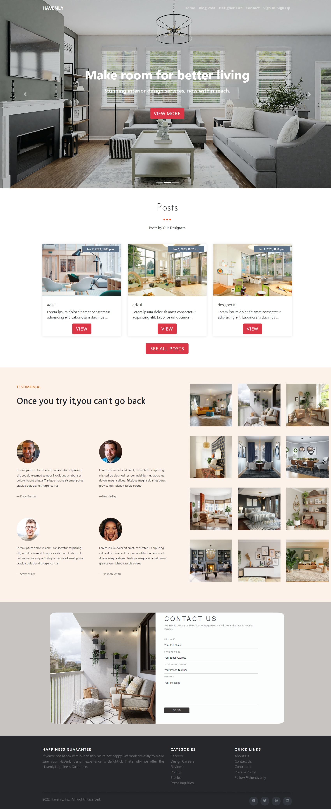
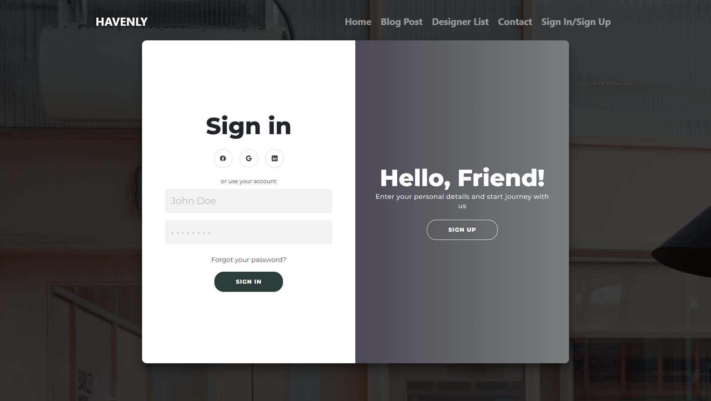

# Havenly Interior Designer Hiring Platform

This projectb was built using django.

**Note: Havenly is registered trademark of Havenly Inc. We do not own the name Havenly. The name havenly was chosen as it is a recognizable name.**

If you have any inquary, please feel free to contact us.

For security reasons, tawk.to script was removed and django secret was commented out.

This project is kind of a Frankenstein of my other projects. The code is not clean as I would have liked.

#### Front End Previews

**Home Page**


**Login/Signup**


<i>Requirements:</i>

1. Python
2. django
3. django-crispy-forms
4. six
5. pillow

Run: <br>

```
pip install django django-crispy-forms six pillow crispy-bootstrap5
```

<br>

To run this application, go to the project folder and open a terminal window.
Run: <br>

```
python manage.py runserver
```
